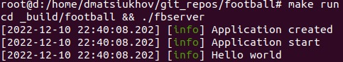

# Football APP

 Footbal - application for football trainers, to work with a database of students, tracking their progress in the format of grades.

---

# Build

Init submodule:

`git submodule update --init --recursive`

Run make Makefile for build:

```
make build   - cmake and make app
make run     - run app
```

# Libs
App libs:
- config - app settings handler lib;
- core - core functional, redis wrapper, etc;

Third party libraries:
- spdlog;


# Run example


